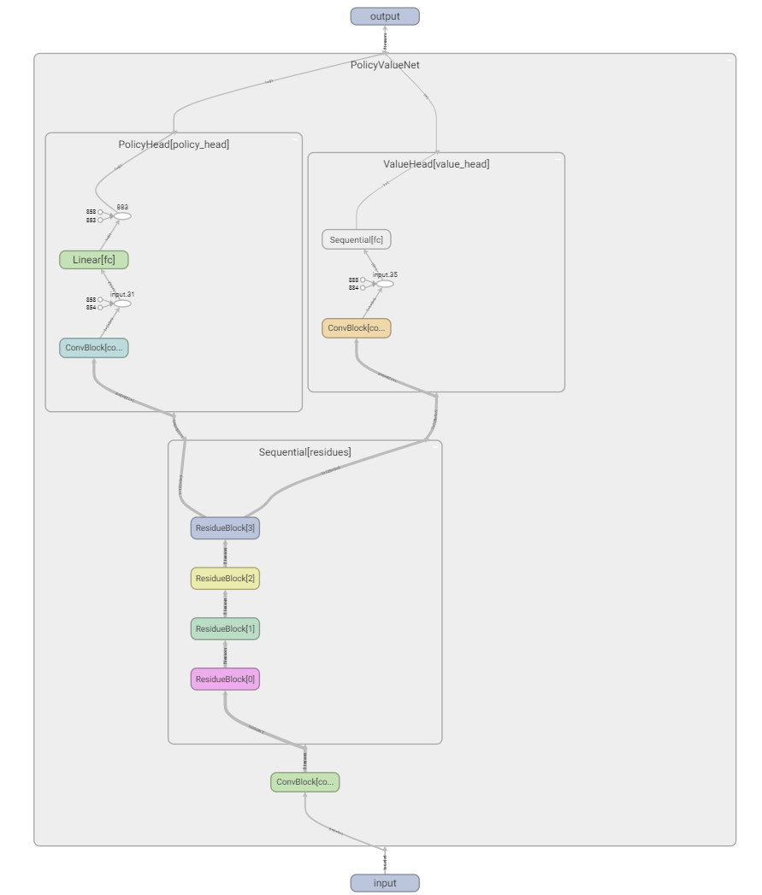

<p align="center">
  
</p>
  <h1 align="center">
  Alpha Gobang Zero
</h1>

<p align="center">
   基于自对弈强化学习的五子棋机器人
</p>

<p align="center">
  <a style="text-decoration:none">
    
  </a>

  <a style="text-decoration:none">
    
  </a>

  <a style="text-decoration:none">
    
  </a>

  <a style="text-decoration:none">
    
  </a>

  <a style="text-decoration:none">
    
  </a>
</p>

<div align="center">

<br>

</div>


## 策略-价值网络
* 网络组成 (各个模块的具体信息参见 [项目大纲](docs/项目大纲.md))
  * `ConvBlock` × 1
  * `ResidueBlock` × 4
  * `PolicyHead` × 1
  * `ValueHead` × 1
* 网络可视化

  

## 快速开始
1. 创建虚拟环境并安装依赖包:

    ```shell
    conda create -n Alpha_Gobang_Zero python=3.8
    conda activate Alpha_Gobang_Zero
    pip install -r requirements.txt
    ```

2. 安装 `PyTorch`，具体操作参见博客 [Pytorch 的安装](https://blog.csdn.net/qq_23013309/article/details/103965619)；


3. 开始游戏:

    ```shell
    python alpha_gobang_zero.py
    ```

## 训练模型
* 开始训练:

    ```shell
    python train_alpha_gobang_zero.py
    ```
    **注意**：这将在上一个模型的基础上接着训练，如果想要重新训练一个模型，请将 `model` 文件夹中的 `best_policy_value_net.pth` 和 `last_policy_value_net*` 删掉，并设置 `train_config` 的 `lr` 为 `0.01`
* 误差曲线

  

## 参考文献
* [Mastering the game of Go without human knowledge](https://www.nature.com/articles/nature24270.epdf?author_access_token=VJXbVjaSHxFoctQQ4p2k4tRgN0jAjWel9jnR3ZoTv0PVW4gB86EEpGqTRDtpIz-2rmo8-KG06gqVobU5NSCFeHILHcVFUeMsbvwS-lxjqQGg98faovwjxeTUgZAUMnRQ)
* [Mastering Chess and Shogi by Self-Play with a General Reinforcement Learning Algorithm](https://arxiv.org/abs/1712.01815)

## 证书
```
MIT License

Copyright (c) 2021 Zhengzhi Huang

Permission is hereby granted, free of charge, to any person obtaining a copy
of this software and associated documentation files (the "Software"), to deal
in the Software without restriction, including without limitation the rights
to use, copy, modify, merge, publish, distribute, sublicense, and/or sell
copies of the Software, and to permit persons to whom the Software is
furnished to do so, subject to the following conditions:

The above copyright notice and this permission notice shall be included in all
copies or substantial portions of the Software.

THE SOFTWARE IS PROVIDED "AS IS", WITHOUT WARRANTY OF ANY KIND, EXPRESS OR
IMPLIED, INCLUDING BUT NOT LIMITED TO THE WARRANTIES OF MERCHANTABILITY,
FITNESS FOR A PARTICULAR PURPOSE AND NONINFRINGEMENT. IN NO EVENT SHALL THE
AUTHORS OR COPYRIGHT HOLDERS BE LIABLE FOR ANY CLAIM, DAMAGES OR OTHER
LIABILITY, WHETHER IN AN ACTION OF CONTRACT, TORT OR OTHERWISE, ARISING FROM,
OUT OF OR IN CONNECTION WITH THE SOFTWARE OR THE USE OR OTHER DEALINGS IN THE
SOFTWARE.

```